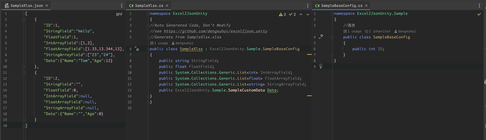
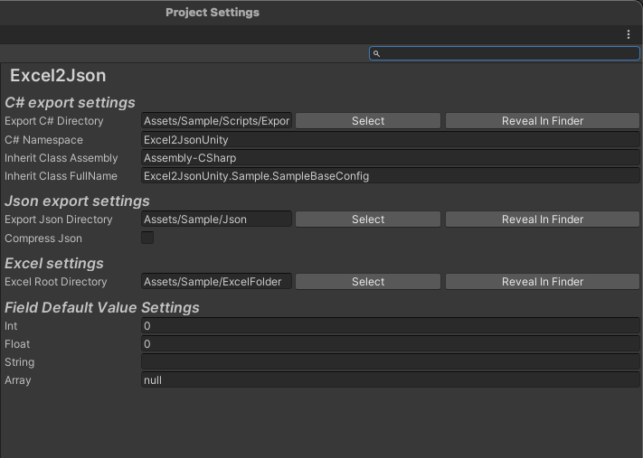
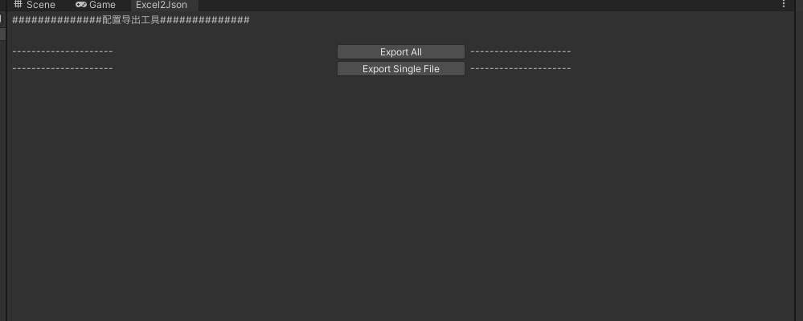

# excel2json_unity

- 支持Excel导出为json并生成c#定义文件
- 支持自定义数据类型
- 支持导出c#文件继承与定义命名空间
  - 自动删除继承类中已经存在的字段
# 项目说明
该工程提供excel配置转json的工具。工具主要包括两个方面：
- Excel导出窗口。这个窗口比较简陋，包括了"导出所有"与"导出单个文件"两个按钮
- Excel导出设置。
## Excel2Json项目设置说明
导入工具之后，需要设置一些与你自己项目相关的配置设置，设置入口在`Edit->Project Settings->Excel2Json`。

### C#导出设置
excel导出json的同时会生成类型定义文件
- `Export C# Directory`设置导出C#的目录，目录需要为工程根目录下的目录
- `C# Namespace`如果导出的C#文件需要定义命名空间，可以在这里设置，如果需要，设置为空就行
- `Run Time Assembly`设置运行时程序集，如果没有特殊定义一般为`Assembly-CSharp`，导出配置与自定义类型映射都会使用到
- `Inherit Class FullName`设置基础类的完整名称，例如`UnityEngine.Object`
### Json导出设置
- `Export Json Directory`设置导出Json的目录，目录需要为工程根目录下的目录
- `Compress Json`设置是否压缩Json文件，压缩后的文件体积更小，但是可读性差。压缩是通过去除空格、换行、制表符实现的
### Excel设置
- `Excel Directory`设置Excel文件所在的目录，目录需要为工程根目录下的目录
### 字段默认值设置
- `Int`设置int类型的默认值，默认为`0`
- `Float`设置float类型的默认值，默认为`0.0`
- `String`设置string类型的默认值，默认为`""`
## Excel导出窗口

导出窗口入口在`Window->Excel2Json`。点击按钮即可导出所有的Excel文件，或者导出单个Excel文件（需要选择文件）
# Excel配置说明
目前支持的字段包括`int`,`float`,`string`,`int[]`,`string[]`,`float[]`这几个基本数据类型，以及一个自定义的组合类型。
所有的数据定义都可以在`SampleXlsx.xlsx`中找到示例。
- 数组分隔符使用`,`进行分割
- 一个Excel只会读取第一张表为数据并导出Json数组文件
- 默认前三行为定义行，第一行为字段名，第二行为字段类型，第三行为字段注释
## 组合类型说明
以`SampleCustomData`举例，其中包含两`Name`和`Age`两个字段，其中`Name`为`string`类型，`Age`为`int`类型。
可以在`Excel2JsonUnity.Sample.SampleCustomData`中找到对应的定义。
- 以`.`来自定组合下的字段类型，目前只支持一层结构，也就是一个`.`的情况

# 扩展说明
如果你需要在现有基础上扩展功能，下面给出几个说明点。
## `Excel2JsonConfig`配置文件
这个文件配置所需要的所有导出规则配置，包含了错误消息定义、ProjectSettings文件路径等设置。
## 扩展Excel支持的类型
如果需要扩展类型，首先找到`ExcelCollector`，这个文件是收集所有Excel字段并返回可用字符串数据。新增类型在`Combine`函数中的`Switch-Case`代码块中

# 未来开发计划
- [x] 支持自定义数据类型（枚举，结构体）
- [ ] 进一步压缩Json文件，目前只是去除了空格、换行、制表符。可以实现压缩字段，并配置序列化来实现json文件的压缩。
- [ ] 使用`USS`美化Editor界面